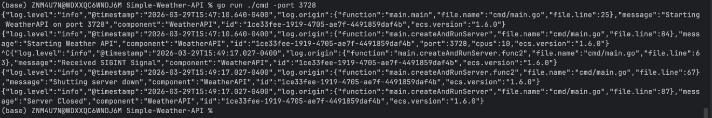
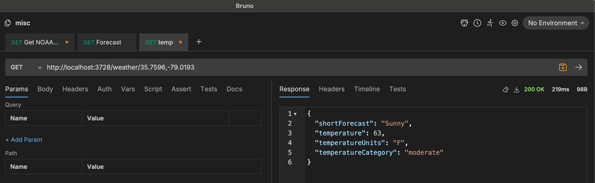
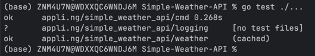
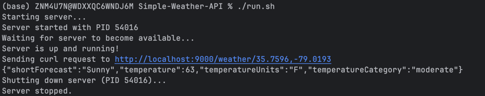

# Simple-Weather-API

A simple weather API which I was requested to create.

The endpoint of interest takes a latitude and a longitude, then queries [api.weather.gov](https://api.weather.gov) for
the current meteorological data near that location in the USA.

A non-erroneous response is a JSON object containing the following:

- A ShortForecast string explaining the forecast,
- A float64 value for the Temperature
- A unit of measure string, for the temperature value
- A TemperatureCategory string of either "hot", "cold", or "moderate"

The API exposes two endpoints

| Endpoint                 | Description                                            |
|--------------------------|--------------------------------------------------------|
| __/*__                   | health check endpoint. Also the default/root endpoint. |
| __/weather/{lat},{lon}__ | Query for weather near a specific coordinate.          |

## Requirements

- Go __MUST__ be installed in order to compile and/or run this server from source
- An API client such as Bruno or Postman, or curl (for utilizing locally).
- Curl is required only if running the integration tests

# Running Locally

### OPTIONAL build step

This step is __OPTIONAL__, go run bundles the build step, so only do this if you really want to build the binary before
running it. To skip the distinct build step, continue on to [the next section](#without-a-distinct-build-step)

```bash
go build -o myBinaryName ./cmd
```

To run after the build, ensure the binary has the executable bit set

```bash
chmod 777 myBinaryName # Only Necessary if the executable bit is not already set
```

#### Run the Binary

```bash
./myBinaryName
```

### Without a distinct build step

There is an easy way with less user flexibility (see the [Integration tests](#integration-tests) section for the easy
way), and the regular way (as described here),

The default port is 9000, but can be changed by providing the -port flag, as shown below

To run from source on a specific port:

```bash
go run . -port 9001
```

### Examples

#### Local Server Terminal Output



#### Bruno Request and Response



# Running Tests

## Local (Unit) Tests

To run the local tests where everything external is mocked:

```bash
go test ./...
```

#### Example output from unit tests



## Integration Tests

[run.sh](run.sh) is a convenience shell script which runs, curls, then shuts down the
server:

```bash
./run.sh
```

#### Example integration test output



# Project Structure

This project is not very elegantly set up, because it is so small and will likely never be needed after next week.
There are 4 folders. 2 of which are actually important to the program's functionality.

| Directory | Contents                                                                   | Core       |
|-----------|----------------------------------------------------------------------------|------------|
| cmd       | houses the main function of the server, plus handlers and middleware       | Yes        |
| weather   | Everything actually used to go interact with the .gov external weather api | Yes        |
| logging   | everything related to setting up the logger for the program.               | Not Really |
| images    | Images used within README.md                                               | No         |
